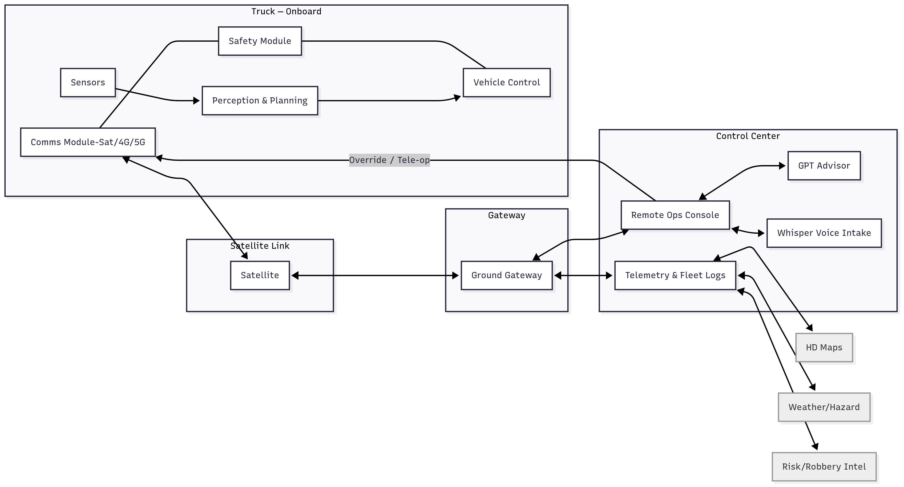

# 🚚 AI-Trucking

*Smart Fleet Optimization Using AI*



## 📌 Overview

AI-Trucking is a project that explores how **Artificial Intelligence (AI)** can improve the efficiency of trucking and logistics.
The goal is to **reduce costs, optimize routes, and improve fuel efficiency** while making transportation smarter and more sustainable.

This project was built as part of my **B.Tech (2nd Year)** journey, combining my learnings in **AI, system design, and software engineering practices**.

---

## ✨ Features

* 📍 **Route Optimization** – Suggests the best routes using AI.
* ⛽ **Fuel Efficiency Insights** – Tracks consumption and gives suggestions to save fuel.
* 🛠️ **System Architecture** – Designed with modular components (data, AI models, visualization).
* 📊 **Visualization** – Easy-to-read dashboards and evaluation metrics.
* 📄 **Documentation** – Includes one-pager, system architecture diagrams, and usage guides.

---

## 🏗️ System Architecture

Here’s how the system works:


* **Data Layer** → Stores trip & fuel data.
* **AI Engine** → Runs optimization and predictions.
* **Visualization** → Displays results in dashboards.
* **User Interface** → Simple interface for interactions.

---

## 📂 Project Structure

```
AI-Trucking/
│── docs/                   # Documentation
│   ├── evaluation-fit.md
│   ├── openai-usage.md
│── design/                 # Design diagrams
│   ├── system-architecture.md
│   ├── one-pager.pdf
│── README.md               # Project introduction
```

---

## 🚀 Getting Started

### Prerequisites

* [Git](https://git-scm.com/)
* [Python 3.9+](https://www.python.org/)
* [Jupyter Notebook](https://jupyter.org/) (for experiments)

### Installation

```bash
# Clone the repo
git clone https://github.com/Somulachaitra/AI-Trucking.git
cd AI-Trucking

# (Optional) Setup virtual environment
python -m venv venv
source venv/bin/activate   # For Linux/Mac
venv\Scripts\activate      # For Windows

# Install dependencies
pip install -r requirements.txt
```

### Running the Project

```bash
python main.py
```

---

## 📊 Evaluation

We measure performance using:

* ✅ **Route optimization accuracy**
* ✅ **Fuel efficiency improvement**
* ✅ **Time saved per trip**

---

## 📘 Documentation

* [One-Pager](design/one-pager.pdf)
* [System Architecture](design/system-architecture.md)
* [Evaluation Fit](docs/evaluation-fit.md)
* [OpenAI Usage](docs/openai-usage.md)

---

## 🌱 Future Scope

* 🚀 Real-time GPS integration
* 📡 IoT sensors for truck monitoring
* 🔒 Blockchain for secure logistics data
* 🌍 Scaling AI to multi-city fleets

---

## 🙋‍♂️ About Me

Hi 👋, I’m **Chaitra Somula**, a **2nd-year B.Tech student** passionate about **AI and Systems Engineering**.
This project is a step towards applying classroom learning to **real-world logistics challenges**.

📧 Contact: \[[your-email@example.com](mailto:your-email@example.com)]
🔗 GitHub: [Somulachaitra](https://github.com/Somulachaitra)

---

⭐ If you liked this project, don’t forget to **star the repo**!

---

👉 Do you want me to also add **badges** (like Python version, license, stars, etc.) to make it look even more professional?
